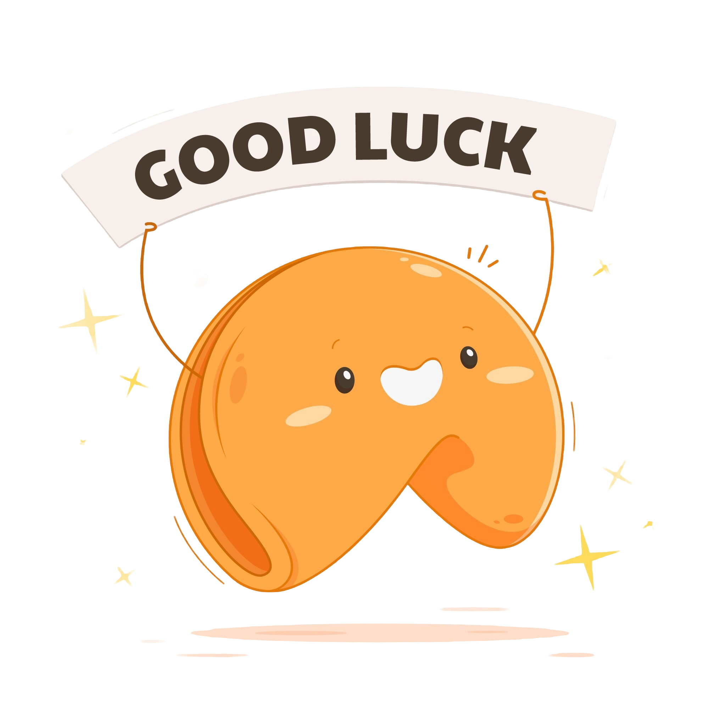
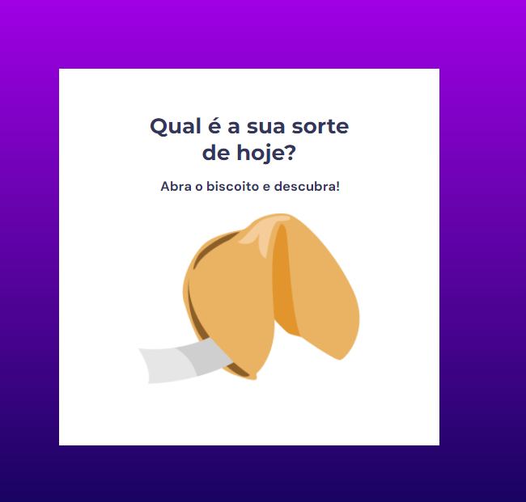

*<h1>Vamos testar nossa sorte?</h1>*

<h2>#Sobre o desafio</h2>

 Neste desafio foi criado um "jogo" chamado Biscoito da Sorte, no qual o usuário, a partir de um clique ou enter, abre um biscoito com a sua sorte do dia. 

[**Veja o vídeo de demonstração do projeto aqui**](./assets/demo.mp4)

Foi aplicado no projeto:

- Estrutura de dados HTML
- Animações com CSS
- Funções no Javascript
- Manipulação da DOM
- Biblioteca JS Math()
- Arrays 

